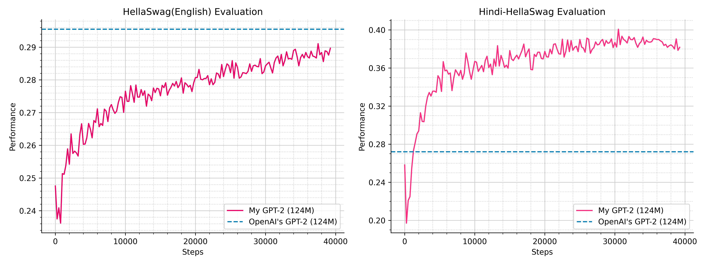
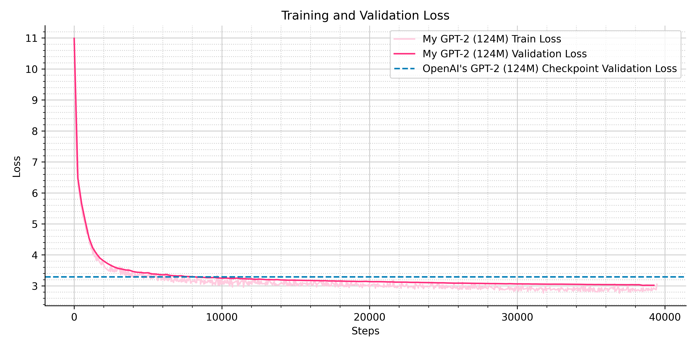

# Reproducing GPT-2 for Indic Languages

I trained a `GPT-2-124M` sized Language Model on 20 Billion tokens from English and Hindi language datasets. I was abel to outperform OpenAI's GPT-2 (124M) on Hindi language benchmark and approximately achieve similar performance in English language task.

I am open-sourcing the the training code, model, training dataset and evaluation.

<p align="center" width="100%">
      
</p>

If you found this project helpful, please consider giving it a star ⭐.

Thank you, and have fun exploring!

## Index
- [Model Card](#model-card)
- [Environment Setup](#environment-setup)
- [Data Preparation](#data-preparation)
  - [Method 1](#for-1)
  - [Method 2](#for-2)
- [Tokeinzer Training](#tokeinzer-training)
- [Pre-Training the Language Model](#training)
  - [Notes for Training on Remote Server](#remote-server-training-notes)
- [Evaluation](#evaluation)
- [Inference](#inference)
- [BibTeX](#citation)
- [References](#references)

## Model Card
|   **Attribute**    |        **Details**        | 
|:-------------------|:-------------------------:|
| Model Type         | Decoder only Transformer  | 
| Architecture       | GPT - Dense               | 
| Number of Layers   | 12                        | 
| Hidden Size        | 768                       |
| MLP Hidden Dim.    | 3072                      |
| Attention Heads    | 12                        |
| Context Length     | 1024                      |
| Vocab Size         | 50,304                    |
| Total Parameters   | ~124M                     |
| Training Type      | Pre-Trained               |
| Dataset            | Fineweb-Edu and Fineweb-2 |
| Languages          | English and Hindi         |
| Training Data Size | ~20 Billion tokens        |
| Batch Size         | 524,288                   |
| Activation         | GELU                      |
| Training Time      | ~14 hours on 1x H100      |


## Environment Setup
Let's first clone this repository
```
git clone https://github.com/Shaligram-Dewangan/GPT-2-for-Indic-Languages
cd GPT-2-for-Indic-Languages
```

Then create a conda environment to manage our packages and activate it
```
conda create -n gpt
conda activate gpt
```
Now, install the required packages
```
pip install torch numpy tokenizers datasets transformers tensorboard tqdm
```


## Data Preparation
We will train our `GPT-2` model on 20 billion tokens, 10 billion from English and 10 billion from Hindi language. 

You could either (1) directly download the [tokenized dataset](https://huggingface.co/datasets/Shaligram-Dewangan/FW_tokenized_20B) or (2) downloload the datasets from [Fineweb-Edu](https://huggingface.co/datasets/HuggingFaceFW/fineweb-edu) and [Fineweb-2](https://huggingface.co/datasets/HuggingFaceFW/fineweb-2) and tokenize it yourself.

#### For (1):
Install [git-lfs](https://git-lfs.com/) by following the steps:
```
sudo apt update
sudo apt install git-lfs

git lfs install
```

Download the already tokinzed dataset, by following these steps:
```
cd data
mkdir datasets
cd datasets

git clone https://huggingface.co/datasets/Shaligram-Dewangan/FW_tokenized_20B
```
And move to the [training section](#training).

#### For (2):
For toknizing the Fineweb-Edu and Fineweb-2 datasets yourself, do the following:
- This will download the `Fineweb-Edu sample-10BT` and `Fineweb-2 hin_Deva` datasets
- And tokenize it using the custom BPE tokeinzer provided in `tokenizer/`

Note: If you would like to train the tokenizer yourself, move to the [tokenizer training](#tokeinzer-training) section and come back to this after it.
```
cd data
python tokenize_datasets.py
```
This might take 2-5 for downloading the dataset (depending on the internet speed, and if not already downloaded) and around 3 hours for tokenization (on a 4-core laptop). 


## Tokeinzer Training
Please note that this is an optional step, but for the interested, here is how you can do it:

First we will prepare a 1 billion token dataset for training the tokeinzer:
```
cd data
python preapere_data_for_tokenizer.py
```
We try to make sure that this dataset contains 50% English and 50% hindi words, so that the tokenizer dosen't become biased towards one language.

Now, we will train the tokenizer using the [BPE algorithm](https://en.wikipedia.org/wiki/Byte_pair_encoding) from the [tokenizers](https://huggingface.co/docs/tokenizers/en/index) library:
```
cd ../tokenizer
python train_tokenizer.py
```
I performed limited-testing of our and OpenAI's GPT-2 tokenizer. We are able to match the English language compression and get a 5.9x better compression for Hindi language, which overall translates 3.3x better token/word.

```
python eval_tokenizer.py
```


## Training
In this section we will perform pre-training of the GPT-2 Language Model. I trained it on a 1x `H100` node in around 14 hours for approximately ₹ 2800 rupees. I was getting around 460000 tok/s processing speed on an `H100`, that translates to around 1.14 second/step. 
```
cd ..
python train.py
```
To monitor your training, run:
```
tensorboard --logdir=logs
```
and go to `http://localhost:6006/`

<p align="center" width="100%">
      
</p>

If you want to play with the code on your laptop without a GPU, I would suggest to reduce batch_size to 512, micro_batch_size to 4, sequence_len to 32, max_steps to 10 and warm_up_steps to 1 in `config.py` file.

### Remote Server Training Notes
To train on a remote server, do all the other steps after `ssh`ing into the remote server. You can `ssh` like this:
```
ssh username@ip-address
```
You will get the `username` and the `ip-address` when you rent an Spot-Instance. You can also connect your VsCode to remote server for better experience.

You will need to do port forwarding to watch tensorboard in your local system's browser. You can do it like this:
```
ssh -L 6008:localhost:6006 username@ip-address
```
You would also like to create a backup of your model checkpoints and logs as they are being created, so that incase the remote session terminates you don't loose your progress.
```
while true; do
  rsync -avzP username@ip-address:/path/to/remote/logs/folder /path/to/where/you/want-to/backup/;
  sleep 1800;
done
```


## Evaluation
For English language performance evaluation I used the [HellaSwag-Eval](https://arxiv.org/pdf/1905.07830). For Hindi language performance evaluation, I wanted something appropriate for language models of this size and something similar to the HellaSwag. 

I found some English-to-Hindi translated versions of the HellaSwag evaluation as well. But, the direct translated versions of the evaluation are devoid of cultural nuances of the target language, and translating the cultural-nuances of the source language many times results in meaning-less sentences.

So I generated [Hindi-HellaSwag](./evaluation/eval_datasets/hindi_hellaswag_val.jsonl) evaluation dataset using [Gemini 2.5 Pro](https://blog.google/technology/google-deepmind/gemini-model-thinking-updates-march-2025/#gemini-2-5-thinking) consisting of ~3500 questions.

|     Evaluation      |  OpenAI GPT-2 (124M)  |  My GPT-2 (124M)  |
| :------------------ | :-------------------: | :---------------: |
| HellaSwag (English) |       **29.55**       |       28.97       |
| Hindi-Hellaswag     |         27.21         |     **38.17**     |


## Inference
For trying out [my GPT-2 model](https://huggingface.co/Shaligram-Dewangan/GPT-2-for-Indic-Languages), you can download it like this:
```
cd logs/exp_2025-05-05_10-50-34
mkdir checkpoints

git clone https://huggingface.co/Shaligram-Dewangan/GPT-2-for-Indic-Languages
cd ../..
```
And run the following file:
```
python inference.py
```
Feel free to change and try various `start_sequence`s in `inference.py`. Please keep in mind that this is a pre-trained only model and not intended for chat usecase.

Please also remember that this is just a language model, and it many times generates incorrect responses.


## Citation
If you liked my project and want to use it somewhere, please consider citing it:
```
@misc{shaligram2025gpt,
  author = {Shaligram Dewangan},
  title = {Reproducing GPT-2 for Indic Languages},
  year = {2025},
  publisher = {GitHub},
  journal = {GitHub repository},
  howpublished = {\url{https://github.com/Shaligram-Dewangan/GPT-2-for-Indic-Languages}}
}
```


## References
1. Andrej Karpathy. *build-nanoGPT*. [GitHub Repo](https://github.com/karpathy/build-nanogpt)

2. "Let's Reproduce GPT-2 (124M)", YouTube video by Andrej Karpathy, 2024. [Watch here](https://www.youtube.com/watch?v=l8pRSuU81PU)

3. Penedo et al. *The FineWeb Datasets: Decanting the Web for the Finest Text Data at Scale*, 2024. [Blog](https://huggingface.co/spaces/HuggingFaceFW/blogpost-fineweb-v1) · [Fineweb-Edu Repo](https://huggingface.co/datasets/HuggingFaceFW/fineweb-edu)

4. Kydlicek et al. *FineTasks: Finding signal in a haystack of 200+ multilingual tasks*, 2024. [Blog](https://huggingface.co/spaces/HuggingFaceFW/blogpost-fine-tasks) · [Fineweb-2 Repo](https://huggingface.co/datasets/HuggingFaceFW/fineweb-2)

5. Google. Gemini 2.5 Pro-Experimental-03-25. April 4, 2025. [Link](https://aistudio.google.com)

6. Vaswani et al. *Attention Is All You Need*. In NeurIPS, 2017. [PDF](https://arxiv.org/pdf/1706.03762)

7. Radford et al. *Language Models are Unsupervised Multitask Learners*. OpenAI, 2019. [PDF](https://cdn.openai.com/better-language-models/language_models_are_unsupervised_multitask_learners.pdf)

8. Brown et al. *Language Models are Few-Shot Learners*. In NeurIPS, 2020. [PDF](https://arxiv.org/abs/2005.14165)

9. Zellers et al. *HellaSwag: Can a Machine Really Finish Your Sentence?* In ACL, 2019. [PDF](https://arxiv.org/pdf/1905.07830)

